# FSDP семинар

---

# Plan

<br>
<br>
<br>

- Prerequisites: CUDA streams / events, DeviceMesh, DTensor
- FSDP2: interface, options, internals
- PyTorch DCP, efficient garbage collection

---

# CUDA streams and events

```python
all_gather_stream = torch.cuda.Stream()

...

# layer 3 unshard
with torch.cuda.stream(all_gather_stream):
    model.layers[3].all_gather()
    all_gather_event_3 = torch.cuda.Event()
    # or all_gather_stream.record_event()

# layer 2 forward
activations = model.layers[2](activations)

# layer 4 unshard
with torch.cuda.stream(all_gather_stream):
    model.layers[4].all_gather()
    all_gather_event_4 = torch.cuda.Event()

# layer 3 forward
torch.cuda.default_stream().wait_event(all_gather_event_3)
activations = model.block[3](activations)

...

```

---

# CUDA streams and events

<br>
<br>
<br>

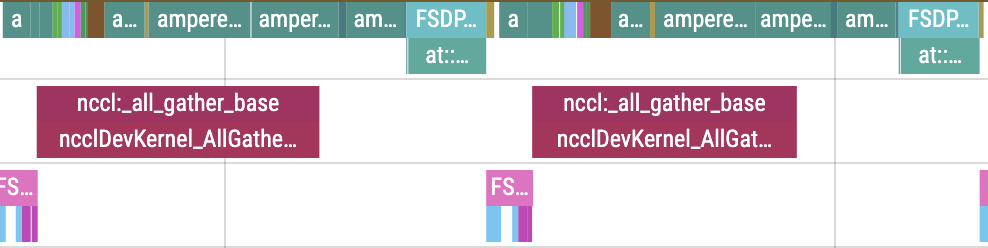

<!--
сказать откуда трейсы
-->

---

# DeviceMesh

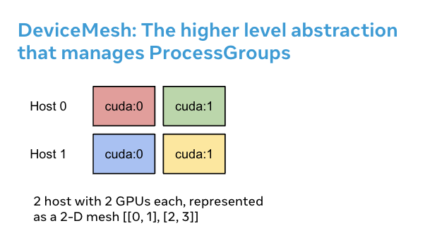

---

# DeviceMesh

```python
from torch.distributed.device_mesh import init_device_mesh

mesh_1d = init_device_mesh("cuda", mesh_shape=(8,), mesh_dim_names=("dp",))
mesh_2d = init_device_mesh("cpu", mesh_shape=(2, 8), mesh_dim_names=("dp", "tp"))
mesh_3d = init_device_mesh(
    "cuda",
    mesh_shape=(2, 2, 8),
    mesh_dim_names=("pp", "dp", "tp"),
)

dp_group = mesh_2d.get_group("dp")
dist.all_gather(..., group=dp_group)

mesh_2d.get_local_rank("tp")

mesh_3d["dp", "tp"]._flatten("dp_tp")

```

---

# DTensor

```python
from torch.distributed.tensor import DTensor, distribute_tensor

mesh = init_device_mesh("cuda", mesh_shape=(8,), mesh_dim_names=("dp",))
big_tensor = torch.randn(1024, 4096)
placements = (Shard(dim=0),)

dtensor = distribute_tensor(
    big_tensor,
    device_mesh=mesh,
    placements=placements,
)
dtensor._local_tensor
dtensor.to_local() # .shape = (512, 4096)


shard = ... # .shape = (512, 4096)
DTensor.from_local(
    shard,
    device_mesh=mesh,
    placements=placements,
) # .shape = (1024, 4096)

dtensor.redistribute(placements=(Replicate(),))
dtensor.full_tensor()
```

---

# DTensor

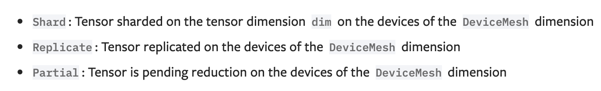
<br>
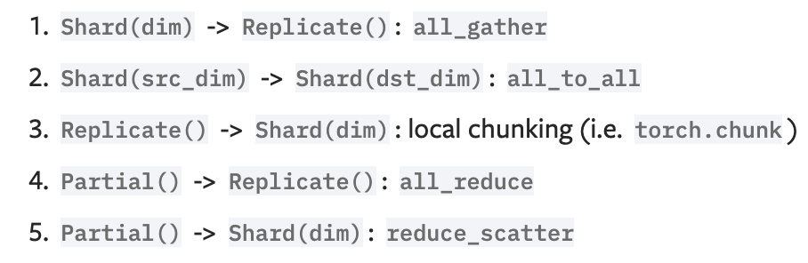

---

# DTensor

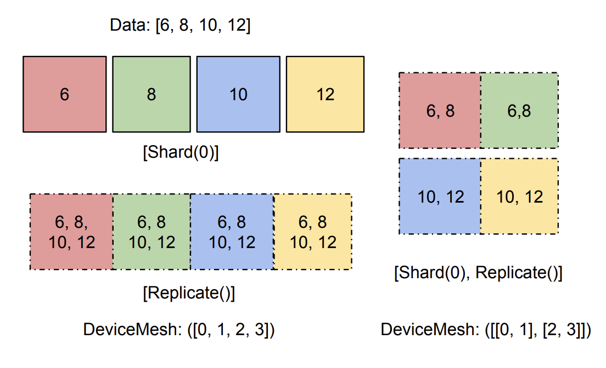

---

# FSDP2


---
layout: two-cols-header
layoutClass: gap-5
---

# FSDP2

::left::

```python
from torch.distributed.fsdp import fully_shard

mesh_2d = init_device_mesh(
    "cuda",
    mesh_shape=(2, 8),
    mesh_dim_names=("dp", "tp"),
)
model = Model()

for layer in model.layers:
    fully_shard(
        module, # (module1, module2)
        mesh=dp_mesh,
        reshard_after_forward=True, # ZeRO-3
        mp_policy=MixedPrecisionPolicy(
            param_dtype=torch.float16,
            reduce_dtype=torch.float32,
        ),
        offload_policy=CPUOffloadPolicy(),
    )

fully_shard(model, ...)
```

::right::

```python
for step in ...:
    for gas_step in ...:
        is_last_backward = gas_step == num_gas_steps - 1
        # ZeRO-3
        model.set_reshard_after_backward(is_last_backward)
        # ZeRO-2
        model.requires_gradient_sync(is_last_backward)

    loss = loss_fn(model(inputs), targets)
    ...
```

---

# FSDP2

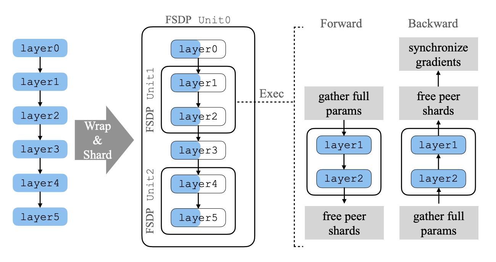

---

# FSDP2 — hooks

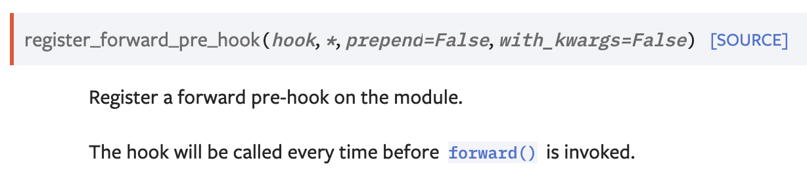
<br>
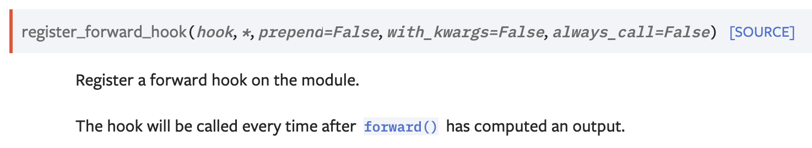

---

# FSDP2 — pre-forward

```python
def pre_forward(module, args):
    module.unshard() # in all-gather stream
    module.wait_for_unshard() # sync compute (default) stream with all-gather stream
    module._register_post_backward_hook(args)
    return args

def unshard(module):
    with torch.cuda.stream(all_gather_stream):
        module.all_gather()
    module.all_gather_event = all_gather_stream.record_event()
    module.set_unsharded_params()

def wait_for_unshard(module):
    torch.cuda.default_stream().wait_event(module.all_gather_event)

def fully_shard(module, ...):
    ...
    module.register_forward_pre_hook(pre_forward)
```

<!--
тут нужно начинать рисовать
-->

---

# FSDP2 — post-forward

```python
def post_forward(module, args, output):
    module.reshard()
    module._record_post_forward()
    module._register_pre_backward_hook(output)
    return output

def reshard(module):
    module.set_sharded_params() # and free unsharded params

def _record_post_forward(module):
    post_forward_index = len(module.comm_ctx.post_forward_order)
    module.comm_ctx.post_forward_order.append(module)
    module._post_forward_indices.append(post_forward_index)

def fully_shard(module, ...):
    ...
    module.register_forward_hook(post_forward)
```

---

# FSDP2 — pre-backward

```python
def pre_backward(module, *unused):
    module.unshard()  # no-op if prefetched
    module.wait_for_unshard()
    module._backward_prefetch()

def _backward_prefetch(module):
    curr_index = module._post_forward_indices.pop()
    target_index = curr_index - 1
    target_module = self.comm_ctx.post_forward_order[target_index]
    target_module.unshard()

def _register_pre_backward_hook(self, output):
    for t in output:
        if torch.is_tensor(t) and t.requires_grad:
            t.register_hook(self._pre_backward)
    return output
```

---

# FSDP2 — post-backward

```python
def post_backward(module, *unused: Any):
    if module.reshard_after_backward:
        module.reshard()
    if module.reduce_grads:
        reduce_scatter_stream.wait_stream(torch.cuda.default_stream())
        with torch.cuda.stream(reduce_scatter_stream):
            module.reduce_scatter_grads()
        reduce_event = reduce_scatter_stream.record_event()

def _register_post_backward_hook(module, args):
    RegisterPostBackwardFunction.apply(self, *args)

class RegisterPostBackwardFunction(torch.autograd.Function):
    @staticmethod
    def forward(ctx, module, *inputs):
        ctx.module = module
        return inputs

    @staticmethod
    def backward(ctx, *grads):
        module.post_backward()
        return (None,) + grads
```

---

# FSDP2 — memory

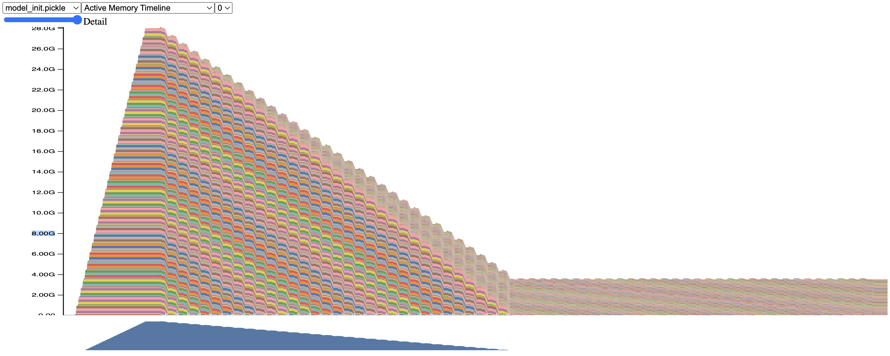

---

# FSDP2 — memory

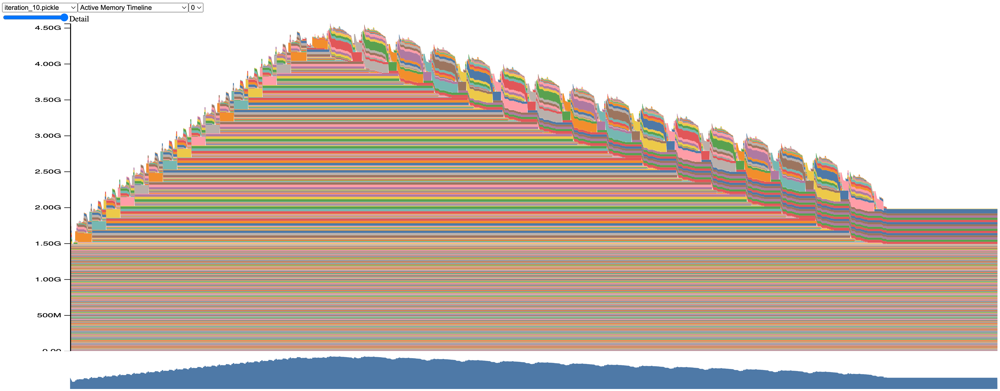

---

# Computation / communication overlap

- Implicit prefetching
  - в `pre_forward`
- Explicit prefetching
  - в `pre_backward`
  - можно задать руками

    ```python
    module.set_modules_to_forward_prefetch(modules)
    module.set_modules_to_backward_prefetch(modules)
    ```

---

# Подробнее про работу со стримами

<br>
<br>
<br>
<br>

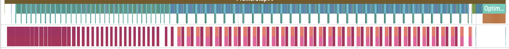

<br>

---

# Подробнее про работу со стримами — forward

<br>
<br>
<br>
<br>

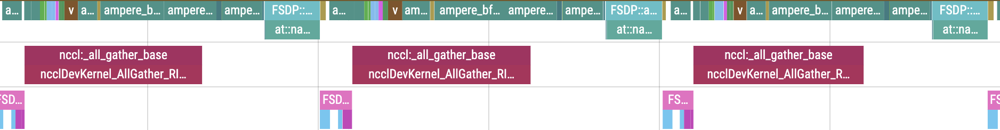

<br>
---

# Подробнее про работу со стримами — backward

<br>
<br>
<br>
<br>

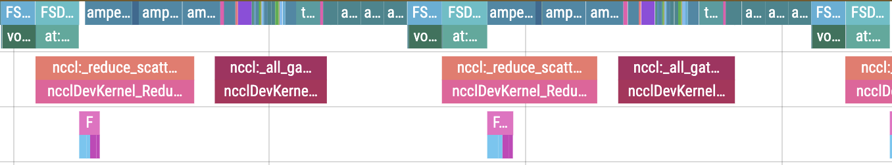

<br>

---

# ZeRO-2

<br>
<br>
<br>
<br>

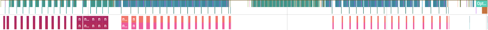

<br>

---

# ZeRO-2

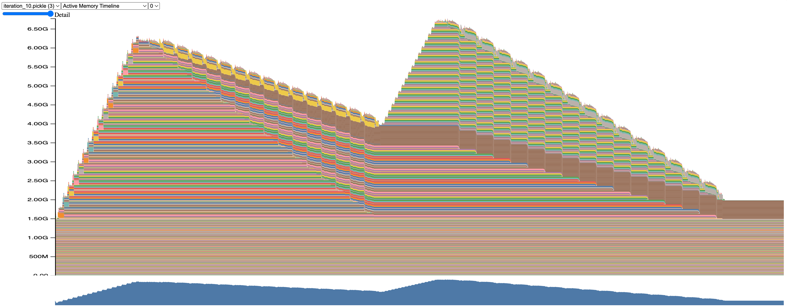

---

# ZeRO-1

<br>
<br>
<br>
<br>

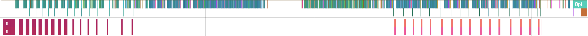

<br>

---

# ZeRO-1

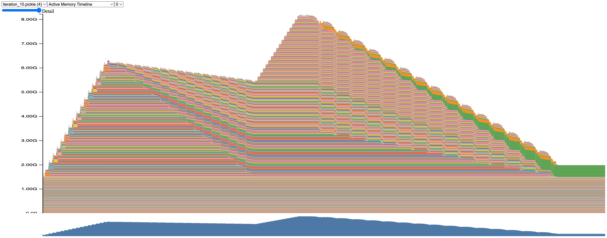

---

# HSDP

```python
mesh_2d = init_device_mesh(
    "cpu",
    mesh_shape=(2, 8),
    mesh_dim_names=("dp_replicate", "dp_shard"),
)

fully_shard(
    module,
    mesh=mesh_2d,
    ...
)
```

<br>

- логика становится заметно сложнее, показывать не буду(

---

# CPU offloading

- [ZeRO-Offload](https://arxiv.org/pdf/2101.06840)

```python
with torch.device("cpu"):
    model = Model()

fully_shard(
    module,
    ...
    offload_policy=CPUOffloadPolicy(),
)

def unshard(module):
    sharded_param = sharded_param.to(
        device,
        non_blocking=True,
    )
    ...
    module.all_gather()

def post_backward(module):
    new_sharded_grad = new_sharded_grad.to(
        torch.device("cpu"),
        non_blocking=True
    )
```

---

# CPU offloading

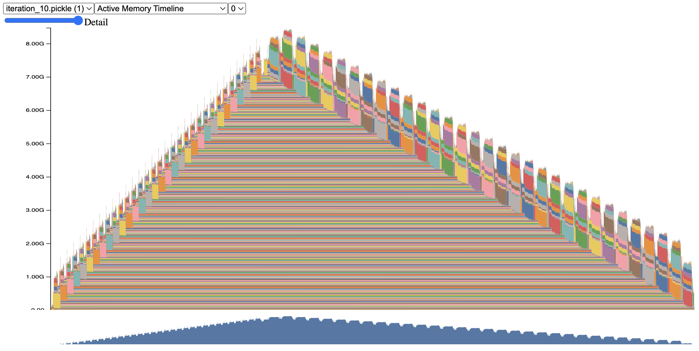

---

# hpZ

- [ZeRO++](https://arxiv.org/pdf/2306.10209)

```python
mesh = init_device_mesh(
    "cuda",
    mesh_shape=(16,),
    mesh_dim_names=("dp",),
)
fully_shard(
    module,
    mesh,
    ...
    reshard_after_forward=8,
)
```

---

# hpZ

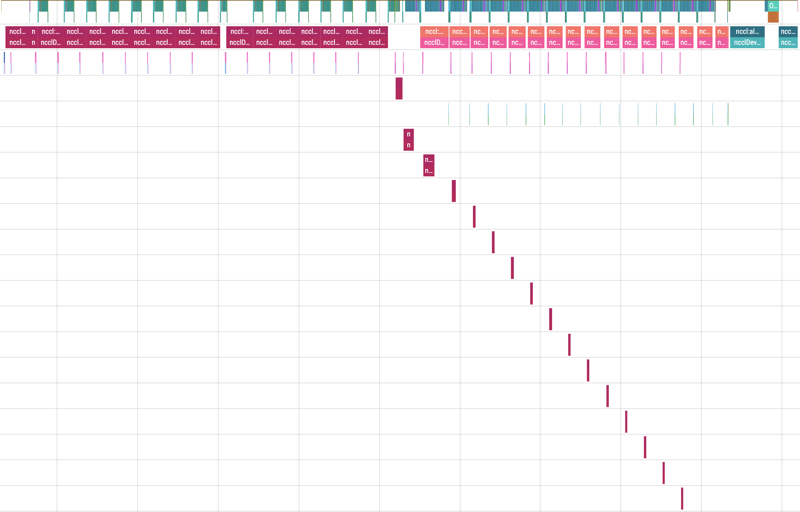

---

# hpZ

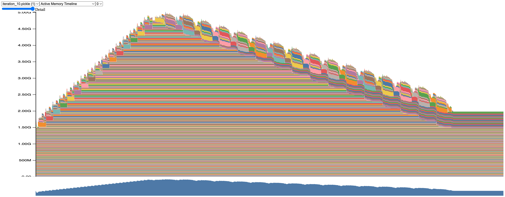

---

# PyTorch DCP

- два вида `state_dict`
  - `SHARDED_STATE_DICT`
  - `FULL_STATE_DICT`
- в FSDP2 всегда sharded, но состоит из DTensor-ов
  - с помощью `.redistribute()` можно менять шардирование чекпоинта
- DCP умеет эффективно отгружать чекпоинты с минимальным оверхедом

---

# PyTorch DCP

```python
import torch.distributed.checkpoint as dcp
model = Model()
fully_shard(model)
optimizer = Optimizer(model.parameters())

state_dict = {
    "model": model.state_dict(),
    "optimizer": optimizer.state_dict()
}
dcp.state_dict_saver.save(state_dict)
dcp.state_dict_loader.load(state_dict)
```

<br>

- [truthfully i's a bit more complicated](https://github.com/pytorch/torchtitan/blob/main/torchtitan/checkpoint.py)

---

# PyTorch DCP

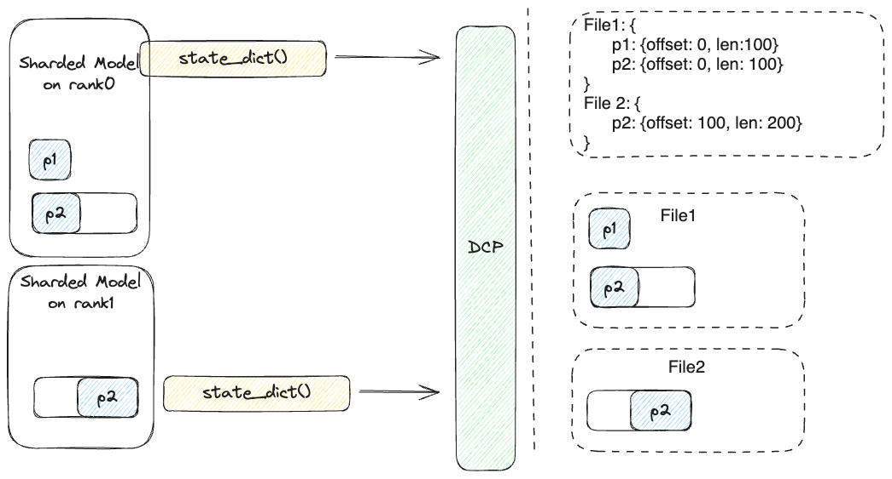

---

# PyTorch DCP

<br>
<br>

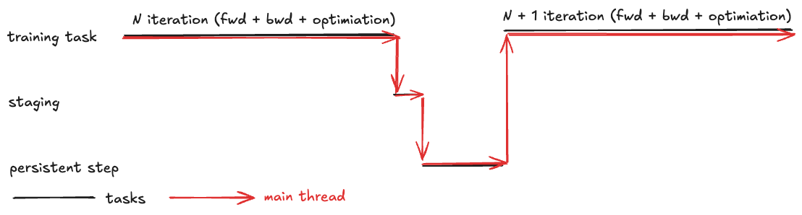

---

# PyTorch DCP

<br>
<br>

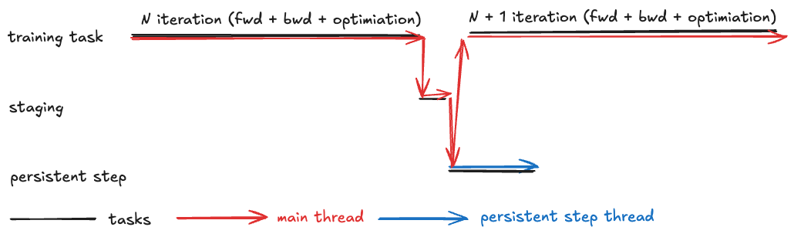

---

# PyTorch DCP

<br>
<br>

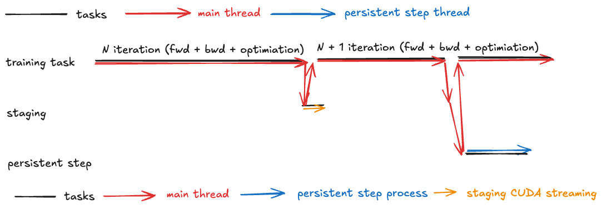

---

# Garbage collection tuning

```python
gc.disable()
gc.collect(1)

... init

for step in ...:
    if step > 1 and step % _gc_freq == 0:
        gc.collect(1)

    ... step
```

---

# Extras

- [SimpleFSDP](https://arxiv.org/pdf/2411.00284)
- `unshard_in_backward`
- meta device init
- compile

---

# Code

- можно поиграться со всем этим в [ноутбуке](https://www.kaggle.com/code/antonyfrolov/practice-ipynb)
- пайплайн отладки
